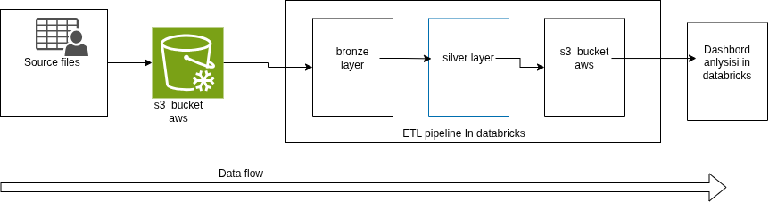

# OmniStream Analytics: Multi-Layered E-Commerce Insights Engine on Databricks

## Background

- E-commerce data ingestion: system processes core operational data consisting of structured customer profiles and transactional orders.
- Cloud-native storage: raw data assets are centralized and staged in Amazon S3 buckets.
- Commercial objectives: provide business teams with immediate visibility into customer purchasing behavior, regional sales performance, and order fulfillment status.

## Problem Statement

- Data quality & inconsistencies: raw S3 datasets contain corrupted data types (for example, text instead of numbers for loyalty points) and missing records (for example, `not_available` phone fields).
- Processing bottlenecks: manual data preparation workflows delay transformation of raw transactional logs into analytics-ready tables.
- Lack of self-service analytics: business users cannot directly query integrated customer and order trends without engineering support.

## Solution Approach

- **Medallion pipeline on Databricks**: a metadata-driven framework ingests raw customer and order files from Amazon S3 and moves them through Bronze (raw), Silver (cleaned/standardized), and Gold (aggregated) layers.
- **Automated data cleansing**: schema enforcement and data quality rules handle missing profiles, parse inconsistent date formats, and correct invalid data types.
- **Empowered business users**: Gold-level business tables power interactive dashboards and a natural-language interface for self-service querying.

## Architecture Diagram

The diagram below illustrates the end-to-end data flow for the OmniStream Analytics pipeline. Source files are ingested into an S3 bucket, staged in a Bronze layer, transformed into a Silver layer, and exposed through a dashboard for analytics consumption.

## Processes 

- Review synthetic datasets and confirm required level of messiness/anonymization.
- Integrate ingestion notebooks to load Bronze data into Databricks.
- Implement Silver transformations and run data quality checks.
- Build Gold aggregations and dashboard views.
- Databricks data analysis